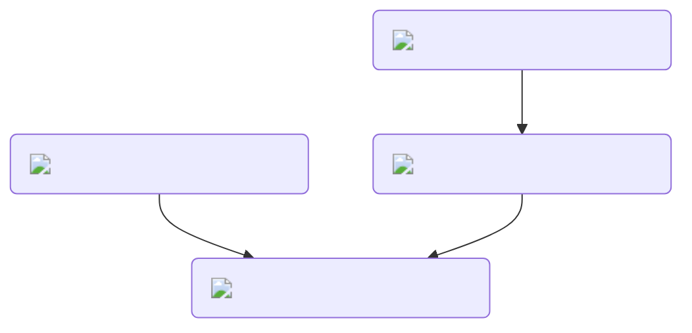

```mermaid
	graph TD;
		A("<img src='https://dummyimage.com/600x400/000/fff'; width='300' />")-->B.png("<img src='https://dummyimage.com/600x400/000/fff'; width='300' />");
		A.png("<img src='https://dummyimage.com/600x400/000/fff'; width='300' />")-->C.png("<img src='https://dummyimage.com/600x400/000/fff'; width='300' />");
		B.png("<img src='https://dummyimage.com/600x400/000/fff'; width='300' />")-->C.png("<img src='https://dummyimage.com/600x400/000/fff'; width='300' />");
```
