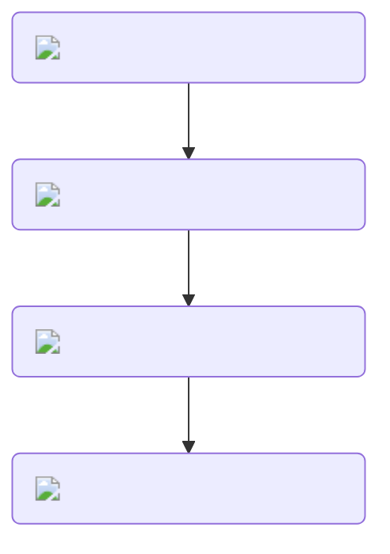

```mermaid
	graph TD;
		0752fb5f9952bd806040614e0c18329d7b78f353.png("<img src='/0752fb5f9952bd806040614e0c18329d7b78f353.png'; width='300' />")-->ddfa8633fa609bc773eae6bb5acd864f431a08a5.png("<img src='/ddfa8633fa609bc773eae6bb5acd864f431a08a5.png'; width='300' />");
		ddfa8633fa609bc773eae6bb5acd864f431a08a5.png("<img src='/ddfa8633fa609bc773eae6bb5acd864f431a08a5.png'; width='300' />")-->d5c6fc24e2cc74e2ce366bb57c4cd8f2cd5c323c.png("<img src='/d5c6fc24e2cc74e2ce366bb57c4cd8f2cd5c323c.png'; width='300' />");
		d5c6fc24e2cc74e2ce366bb57c4cd8f2cd5c323c.png("<img src='/d5c6fc24e2cc74e2ce366bb57c4cd8f2cd5c323c.png'; width='300' />")-->c3a89d66f6c11de472e949b795f44985a53f290d.png("<img src='/c3a89d66f6c11de472e949b795f44985a53f290d.png'; width='300' />");
```
